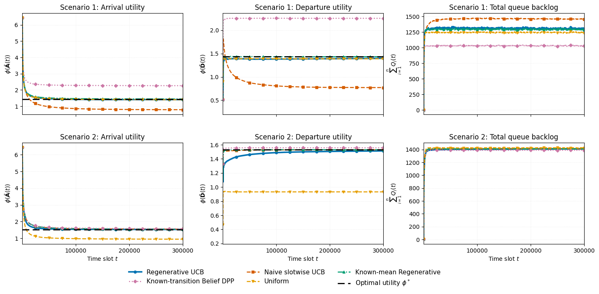
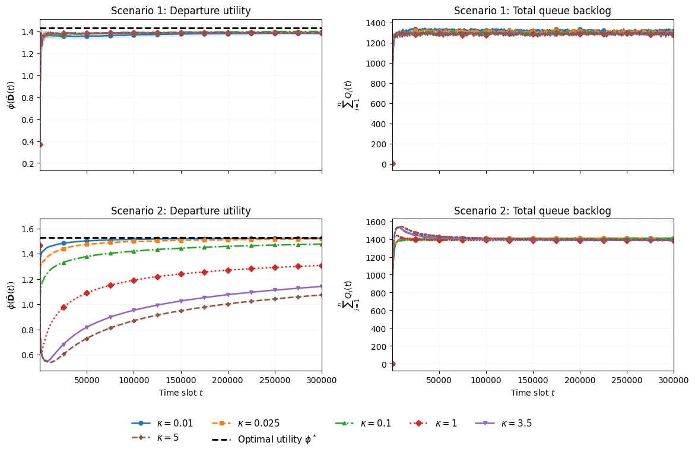

# Network utility maximization with restless Markovian bandits

Simulation code for the accompanying paper. The functions are split from [the source Colab notebook](notebooks/Makov_Bandits_Simulations.ipynb) into importable modules. The simulation and plotting function bodies are copied from that notebook; `run.py` supplies parameters and a configurable output folder.

## Simulations

Four queues share one server. In each time slot, a controller chooses admissions and schedules one queue for service. Every queue's service state evolves according to its own two-state Markov chain, including when it is not scheduled. The service values are `0.05` and `1`. Scenario 1 and Scenario 2 use the transition matrices in [`experiments/scenarios.py`](experiments/scenarios.py).

The utility is `φ(x) = Σᵢ log(1 + 4xᵢ)`. The horizontal reference `φ*` is the optimum among stationary state-oblivious policies, computed from the stationary service means. Under Markovian dynamics, a transition-aware policy can exceed this reference.

The main experiment compares Regenerative UCB, naive slotwise UCB, known-mean regenerative scheduling, known-transition belief DPP, and uniform random scheduling. Each has time-average arrival utility, time-average departure utility, and total queue backlog. In the current main and sensitivity experiments, Regenerative UCB uses

```text
L = 2 κ / ε_min,        κ = 0.025 in the main comparison
V = 0.2 sqrt(H),        d = min(H, ceil(log(H) / (ε_min c_d))).
```

The two scenarios have `ε_min = 0.0784` and `0.64`, respectively. Thus, the main run uses `L ≈ 0.637755` and `d = 322` in Scenario 1, and `L = 0.078125` and `d = 40` in Scenario 2. These are empirical settings; the paper's sufficient theoretical condition is `κ > 3`. The main-comparison function also passes its calculated `L` to naive slotwise UCB. The standalone `L = 0.5` and `L = 0.1` assignments in the notebook's scenario cells have no effect because the function recomputes `L`.

The notebook's **horizon-scaling function still uses `L = 28 κ / ε_min` with `κ = 0.002`**. Its results are a separate experiment and are not in the current manuscript's main or sensitivity figures. The repository preserves that function exactly as it appears in the latest notebook.

| Experiment | What it produces | Defaults |
| --- | --- | --- |
| Main comparison | Three CSVs and individual plots per scenario, plus a combined 2×3 figure | `H = 300,000`, 30 runs per scenario, `κ = 0.025`, `c_d = 0.5` |
| κ sensitivity | Departure utility and total backlog for `κ ∈ {0.01, 0.025, 0.1, 1, 3.5, 5}`; scenario CSVs/plots and a combined 2×2 figure | `H = 300,000`, 30 runs per scenario, `c_d = 0.5`. Within a run, the same Markov trajectories are reused across κ values. |
| Horizon scaling | Departure-utility shortfall and terminal backlog versus `H`, with per-run CSVs | Scenario 1: `H = 10,000` through `60,000` in 10,000-slot steps, `c_d = 1`, 2 runs. Scenario 2: `H ∈ {3,000, 10,000, 30,000, 100,000, 300,000}`, `c_d = 0.5`, 30 runs. |

The Scenario 1 horizon cell in the notebook asks for one run, but its plotting function requires at least two to calculate confidence intervals. The command-line runner uses **two** by default; all simulation and plotting function bodies remain the notebook's.

Within each plotted time series, the curve is the average across independent runs and its shaded band is the pointwise approximate 95% confidence interval `mean ± 1.96 s/√N`. A narrow band can be hidden under the curve.



The image above comes from the latest notebook. Running the main experiment in both scenarios creates a fresh `Paper_Plots/Main_Results_2x3.png` from its CSVs.



Running the sensitivity experiment in both scenarios creates `Paper_Plots/Kappa_Sensitivity_2x2.png`. The preview figures are included for orientation; the commands below recompute results in your chosen output folder.

## Run the whole repository

Install Python 3.10 or newer. From the repository root:

```bash
python -m pip install -r requirements.txt
python run.py --output-dir "./results" --seed 2026
```

`--output-dir` can be any writable folder, including a mounted Google Drive path or a path with spaces. The runner creates the scenario and figure subfolders beneath it. The seed is optional; include it for repeatable random draws. The default runs are computationally expensive.

### Google Colab

After adding these files to your GitHub repository, run these cells in Colab:

```python
!git clone https://github.com/mevanwijewardena/Markov-Chain-Bandits.git
%cd /content/Markov-Chain-Bandits
!python -m pip install -r requirements.txt
```

```python
from google.colab import drive
drive.mount("/content/drive")
```

```python
import subprocess

OUTPUT_DIR = "/content/drive/MyDrive/Markov_Chain_Bandits"  # Choose your folder.
subprocess.run(
    ["python", "run.py", "--output-dir", OUTPUT_DIR, "--seed", "2026"],
    check=True,
)
```

For a quick end-to-end software check, use a **different** output folder:

```bash
python run.py \
  --output-dir "./smoke results" \
  --num-sims 2 --horizon 80 --horizons 40,80 \
  --kappa-values 0.01,0.025 --seed 123
```

These tiny runs check wiring and file formats; they do not reproduce the paper's results.

## Run an experiment or rebuild a figure

```bash
# Main comparison in both scenarios; also creates its combined 2×3 figure.
python run.py --experiment main --scenario both --output-dir "./results" --seed 2026

# κ sensitivity in both scenarios; also creates its combined 2×2 figure.
python run.py --experiment kappa-sensitivity --scenario both --output-dir "./results" --seed 2026

# Horizon scaling in Scenario 2.
python run.py --experiment horizon --scenario 2 --output-dir "./results" --seed 2026

# Rebuild both paper figures from existing CSVs without rerunning simulations.
python -m paper_plots.run --figure all --output-dir "./results"
```

For only one paper figure, use `--figure main` or `--figure kappa-sensitivity`. Both combined figures require CSVs from **both** scenarios; the plot command lists any missing files.

`run.py` accepts `--scenario 1`, `2`, or `both`; `--experiment main`, `horizon`, `kappa-sensitivity`, or `all`. The default `κ` is `0.025` for the main experiment and `0.002` for horizon scaling, matching their respective notebook cells. `--kappa` overrides either default. You can set `--kappa-values 0.01,0.025,0.1` for the sensitivity grid, `--horizon 300000` for the main and sensitivity experiments, `--horizons 3000,10000` for horizon scaling, and `--num-sims 30` for the run count. At least two runs are required to calculate confidence intervals. See `python run.py --help` for the full option list.

## Output layout

All paths below are relative to the chosen `--output-dir`:

```text
OUTPUT_DIR/
├── Scenario_1/
│   ├── ArrivalUtility.{csv,pdf,png}
│   ├── DepartureUtility.{csv,pdf,png}
│   ├── TotalQueueSize.{csv,pdf,png}
│   ├── Horizon_Scaling/HorizonScaling.{csv,pdf,png}
│   └── Kappa_Sensitivity/Kappa_Sensitivity.{csv,pdf,png}
├── Scenario_2/
│   └── [the same experiment files]
└── Paper_Plots/
    ├── Main_Results_2x3.{pdf,png}
    └── Kappa_Sensitivity_2x2.{pdf,png}
```

The main and sensitivity CSVs contain plotted means and lower/upper 95% confidence bounds. Horizon scaling also writes raw per-run results. Rerunning an experiment in the same output folder replaces that experiment's result files.

## Code layout

| Path | Role |
| --- | --- |
| `run.py` | Runs scenarios and experiments under a custom output root. |
| `experiments/scenarios.py` | Scenario transition matrices and default settings. |
| `experiments/main_comparison.py`, `horizon_scaling.py`, `kappa_sensitivity.py` | Experiment functions from the notebook. |
| `markov_bandits/model.py`, `policies.py`, `metrics.py` | Markov model, scheduling policies, and metrics. |
| `markov_bandits/simulation_plots.py` | Per-experiment plots and CSV writers. |
| `paper_plots/` | Combined 2×3 and 2×2 figures, plus a plot-only command. |
| `notebooks/Makov_Bandits_Simulations.ipynb` | Attached source notebook retained as a reference. |

The reference notebook still contains its original fixed Colab Drive paths. Use `run.py` when you want all outputs under a custom folder.
